# Corp

### 绕过Applocker
AppLocker（应用程序控制策略）是 Windows 7 所引入的应用程序白名单技术，它允许根据程序路径、程序发布者和程序哈希值来限制用户可以执行哪些程序。 
有很多方法可以 绕过AppLocker，如果 AppLocker 配置了默认的 AppLocker 规则，我们可以通过将想要执行的exe文件放在以下目录中来绕过 AppLocker 限制：C:\Windows\System32\spool\drivers\color - 默认情况下这会是目标系统上的白名单中的路径。 
开启python http服务 
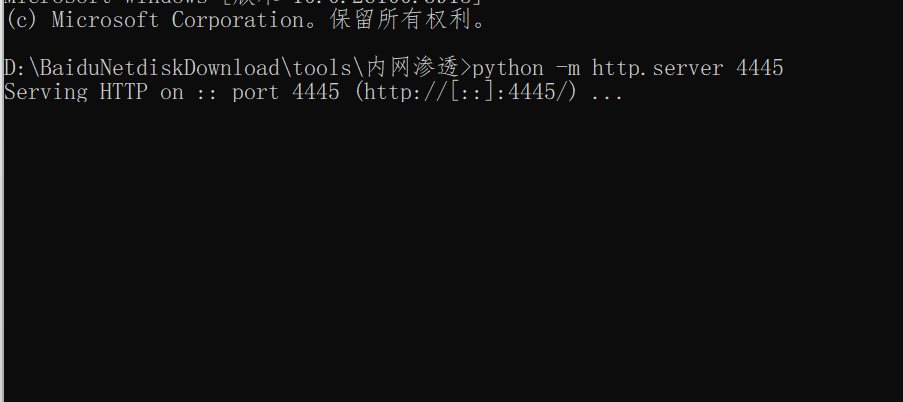 
powershell命令从http服务里下载二进制文件到C::\Windows\System32\spool\drivers\color目录，看到可以成功执行 
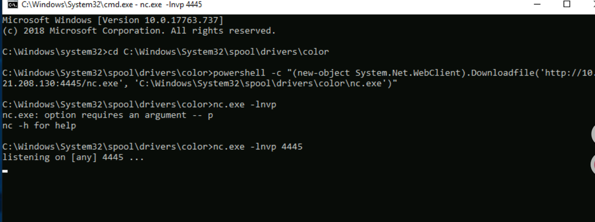

### Kerberoasting攻击
Kerberos 是 Windows 和 Active Directory 网络的身份认证系统。有许多针对 Kerberos认证 的攻击，在本次主要使用请求服务票据尝试获取票据哈希值的攻击 
首先枚举SPN账户信息 
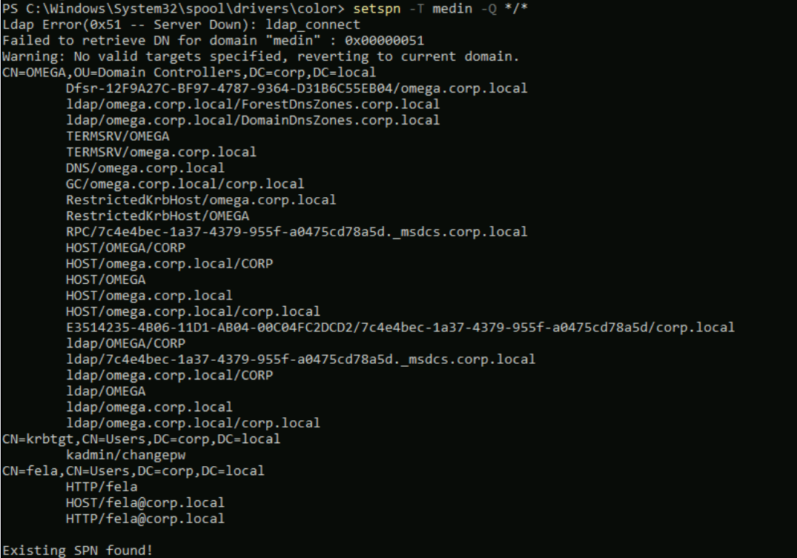 
接下来将攻击脚本上传到指定目录 
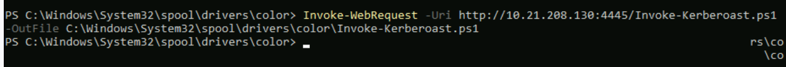 
运行脚本获取SPN票据 
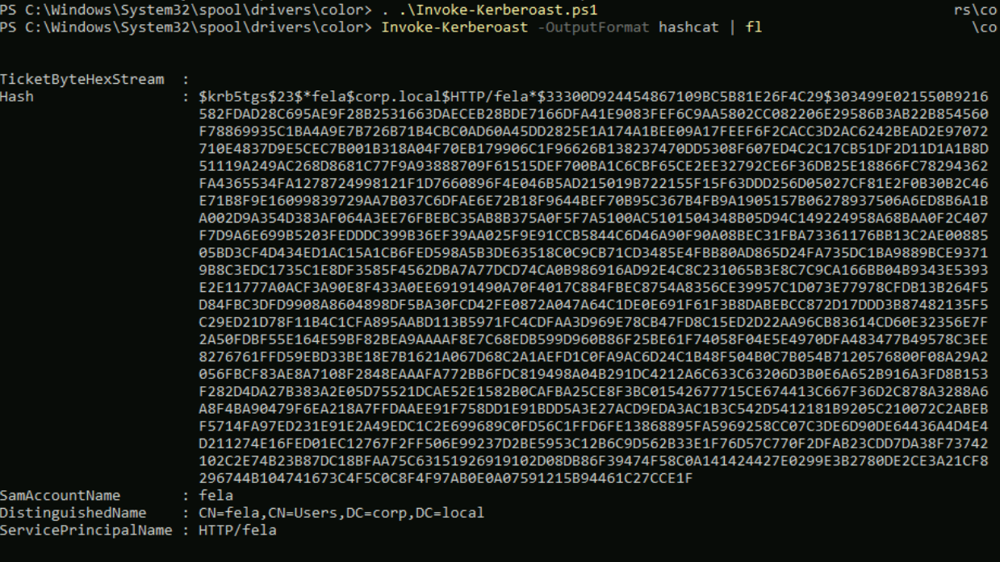 
解密得到明文 
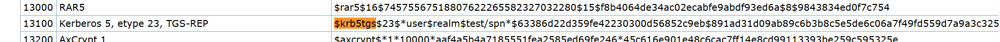 
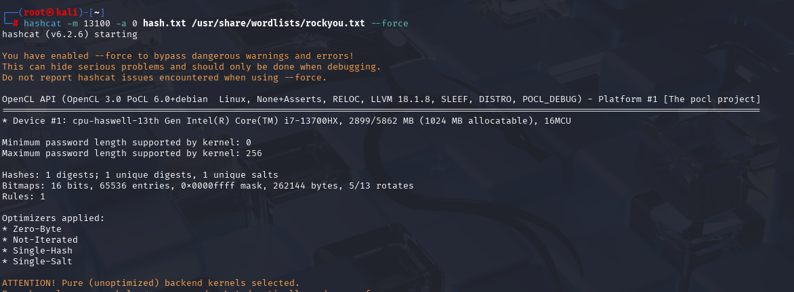 
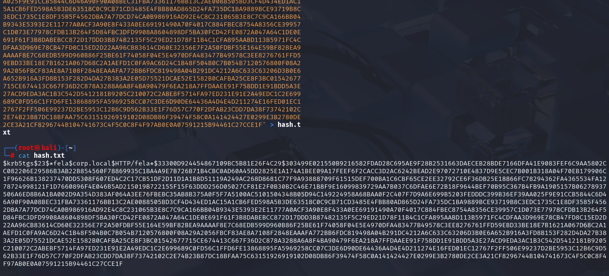 
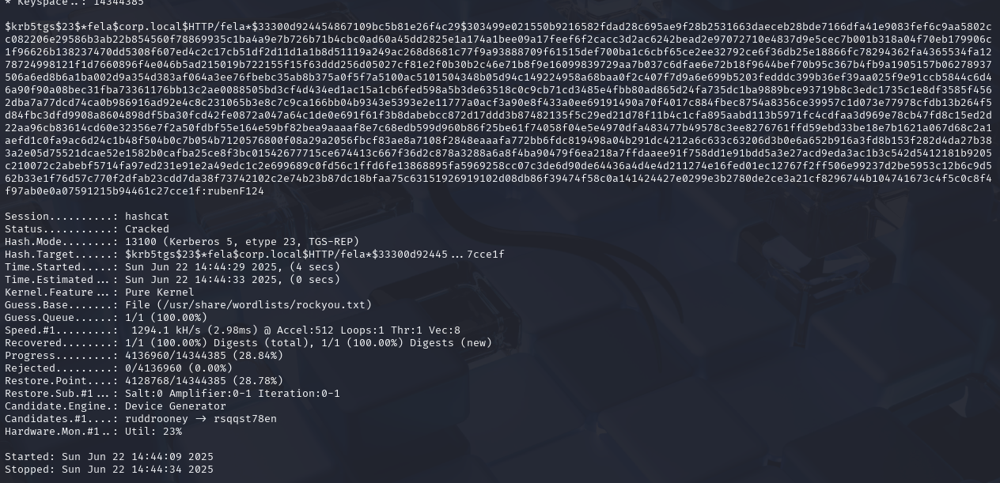 
利用获取到的凭证远程连接 
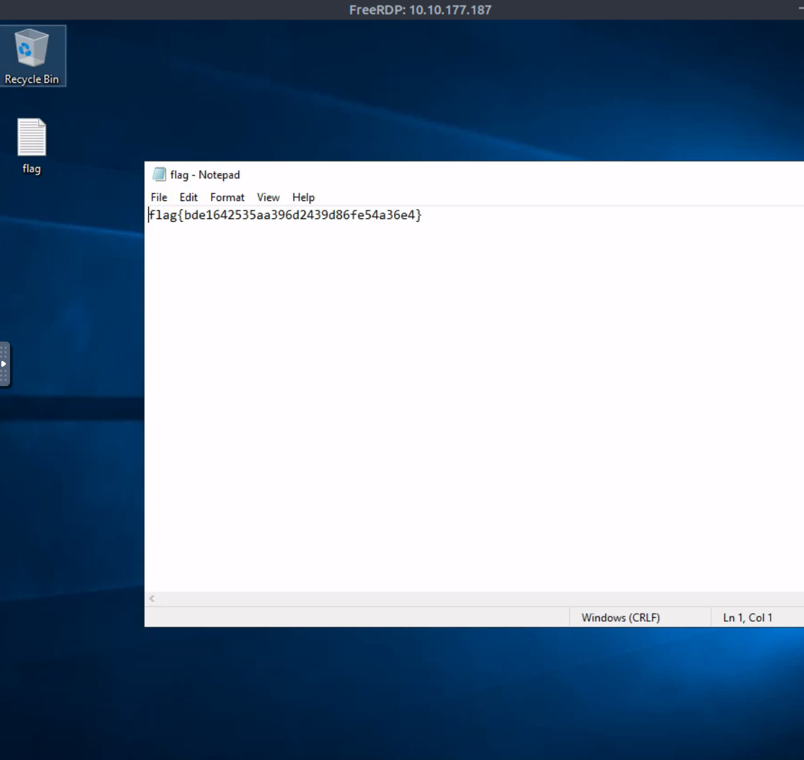

### UnattendPath提权
无人值守安装(Unattended Setup)是原始设备制造商 (OEMs)、公司和其他用户在无人值守模式下安装 Windows NT 的方法。 
首先上传向量枚举脚本并运行 
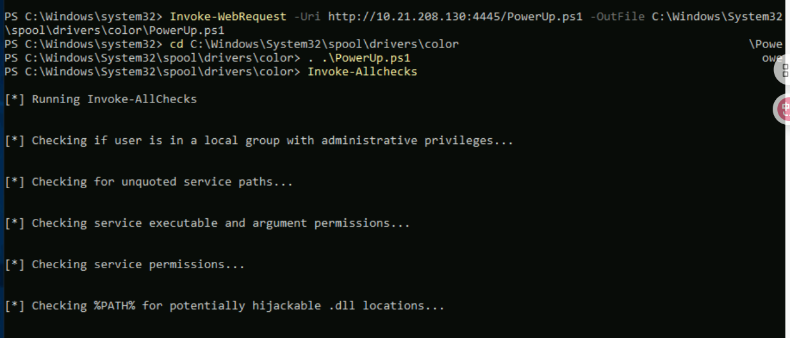 
可以看到存在UAC提权与UnattendedPath提权，我们使用UnattendedPath提权 
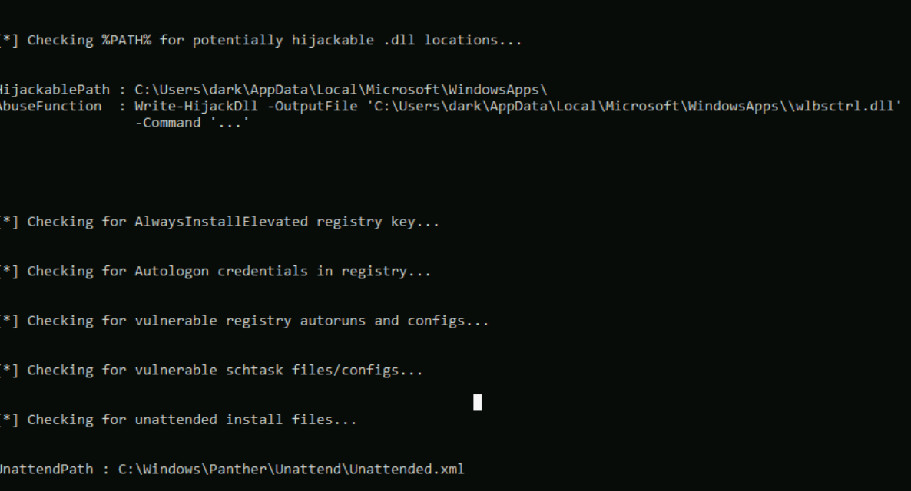 
读取xml文件获取base64编码后的密钥，进行解码并远程连接 
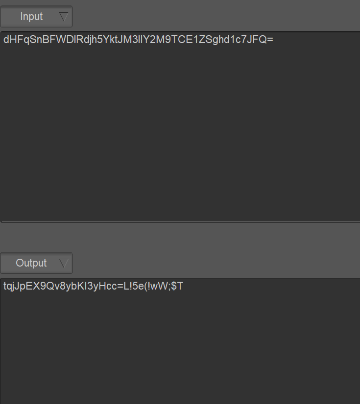 
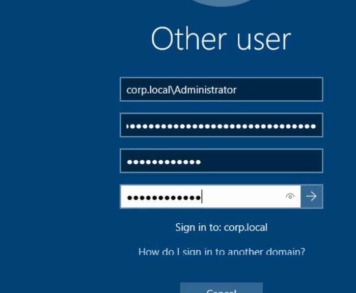 
提权成功 
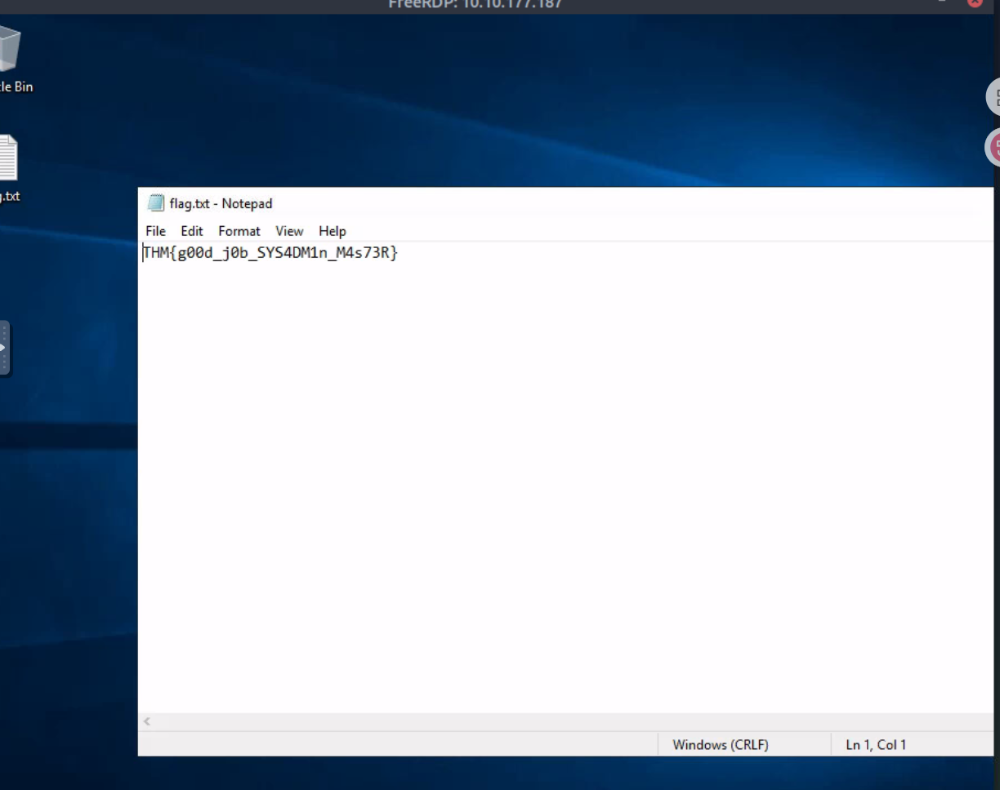