# Daily Bugle

### 1.信息收集
nmap扫描，看到开启了ssh、http、mysql服务，其中检测出了是joomla-cms 
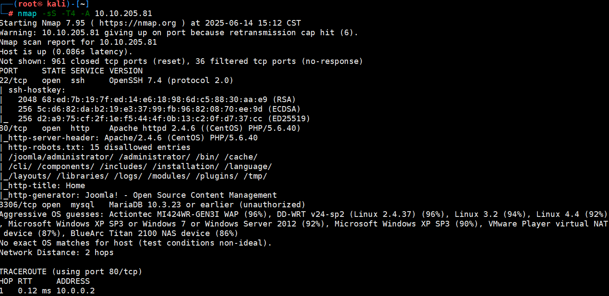 
dirsearch扫描目录发现了cms配置文件和administrator目录 
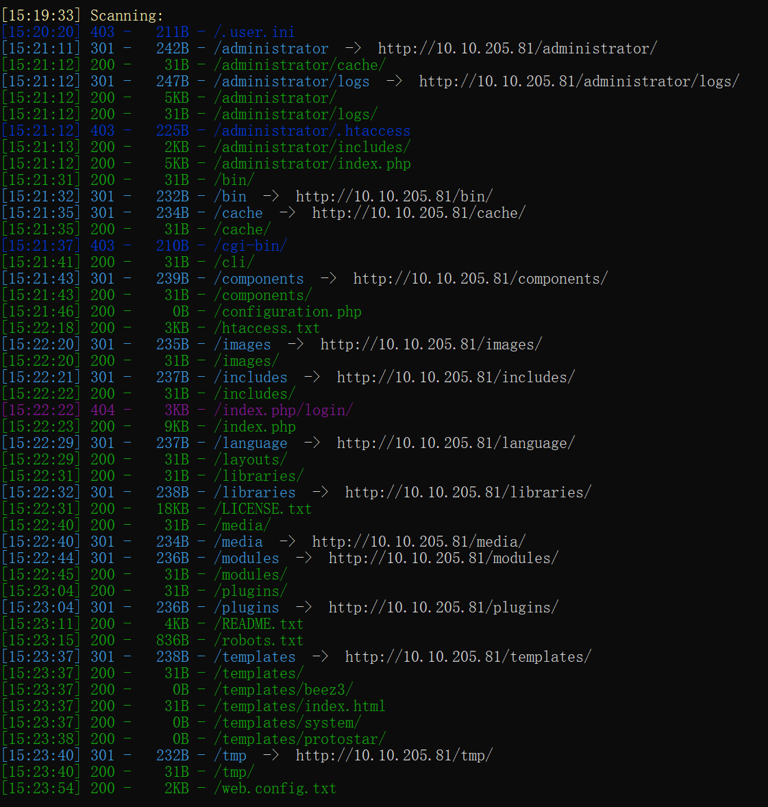 
web.config文件里还有一些rewrite配置 
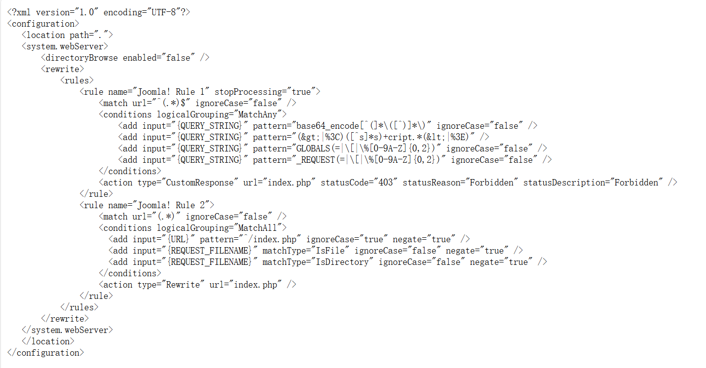 
在自述文件里能发现CMS版本是3.7 
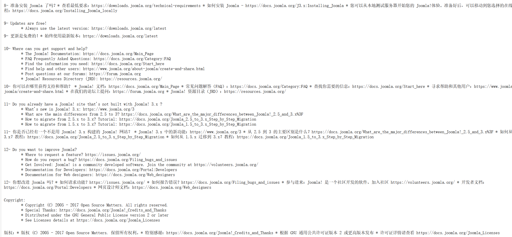

### 2.利用sqli
搜索历史漏洞，发现存在sql注入漏洞 
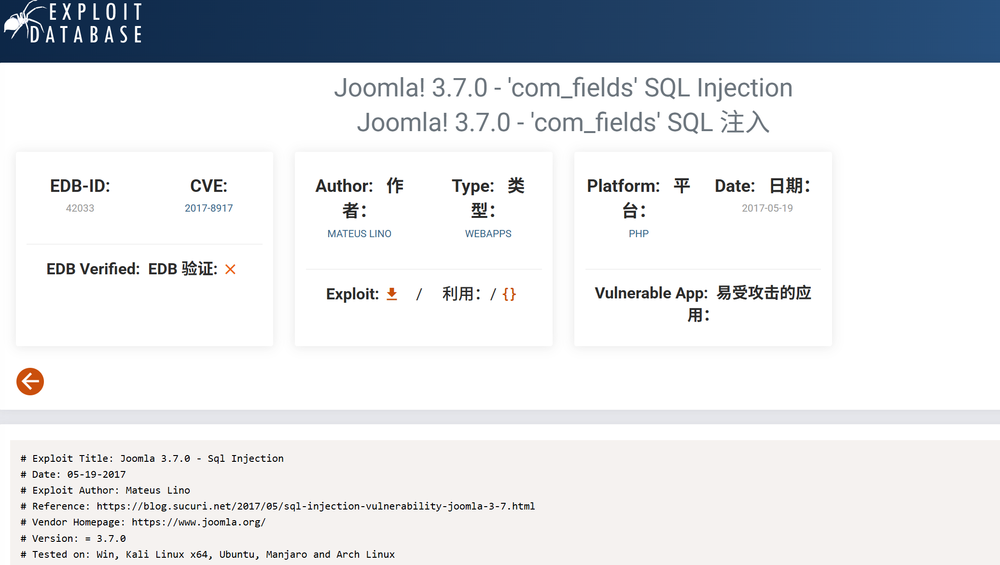 
去网上找一个利用脚本，注出了后台管理员的账号密码 
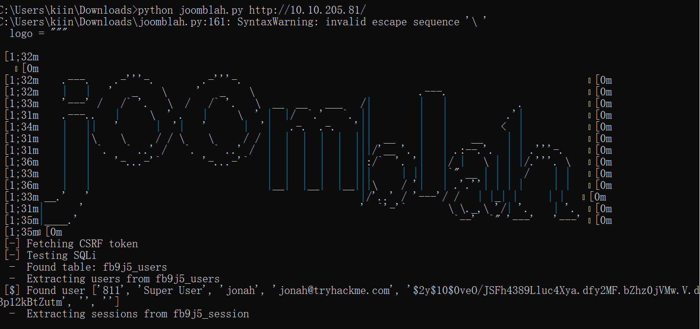 
搜索一下加密特征，也可以直接搜索这个cms的3.7.0版本用的什么密码加密 
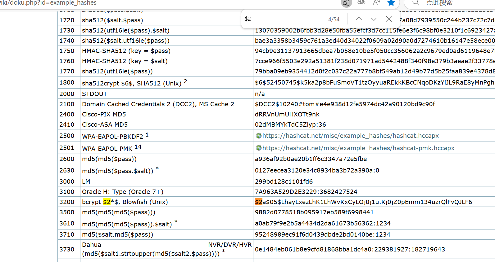 
john爆破密码 
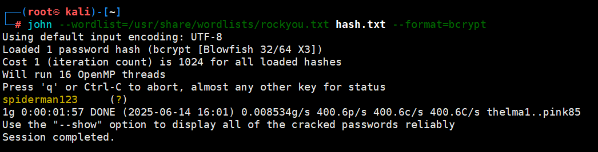 
登陆后台，直奔templates选项修改模板，把index.php重写为反向shell 
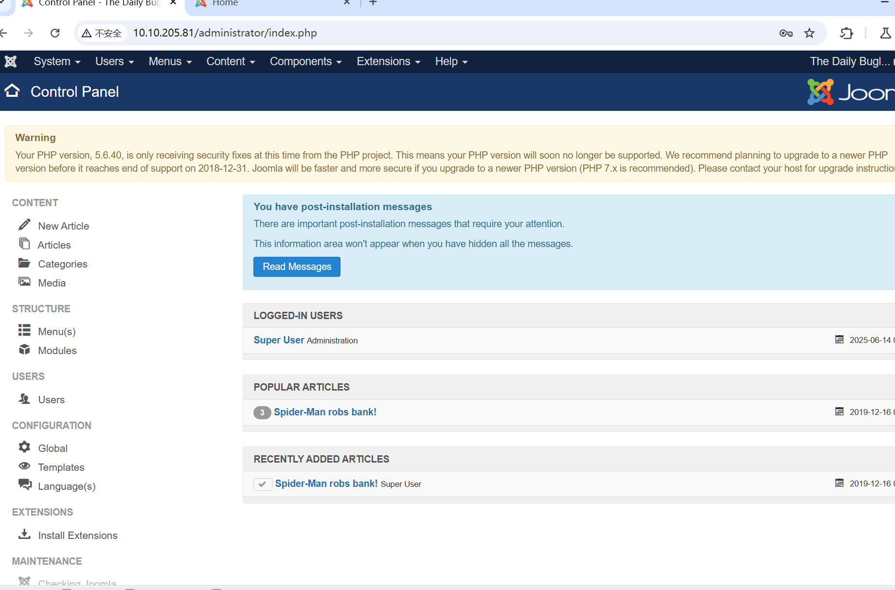 
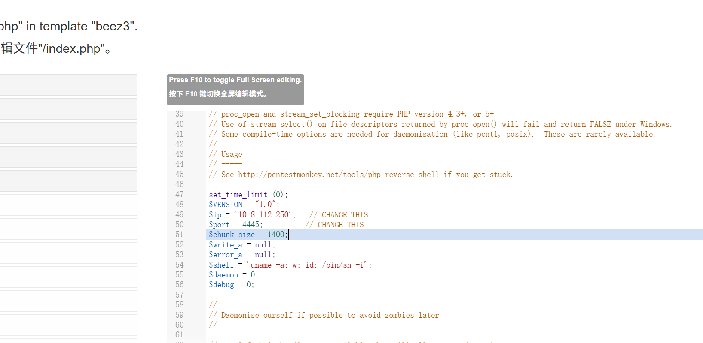 
访问后getshell 
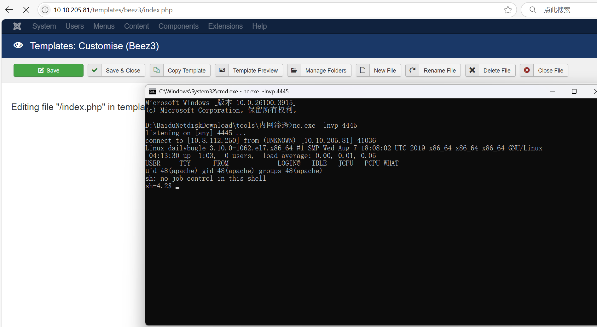

### 3.提升权限
首先是去web目录下查看cms配置文件，看看连接数据库的账号密码是什么 
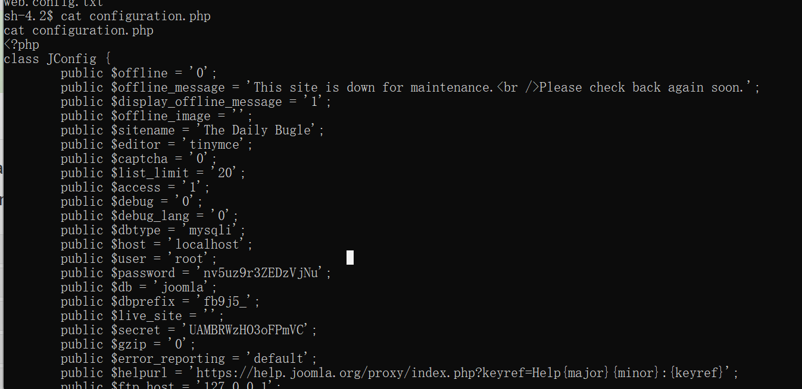 
尝试了su为root，但发现不成功，看一下home下的其他用户，之后su成功了。这样就可以ssh连上去 
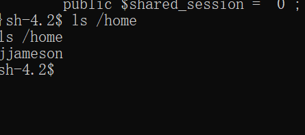 
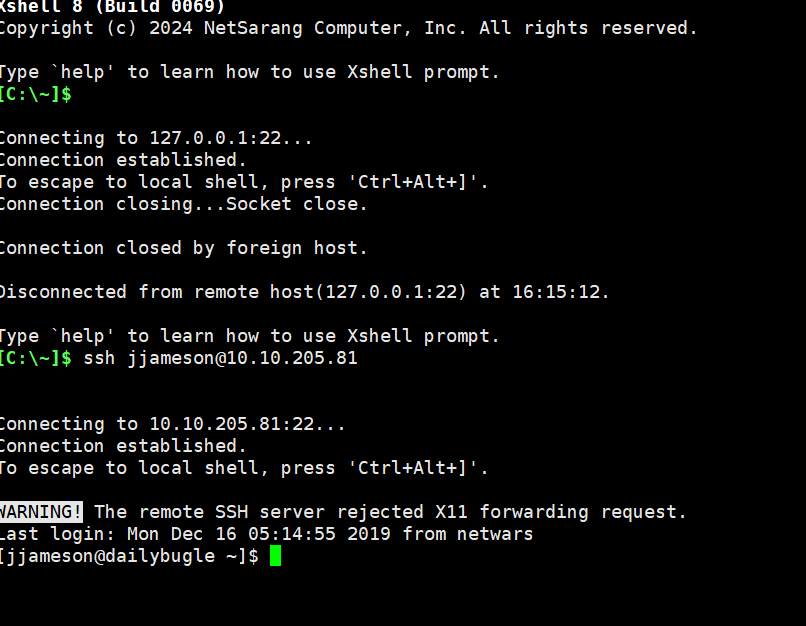 
开始枚举提权向量，在sudo中发现该用户可以运行yum 
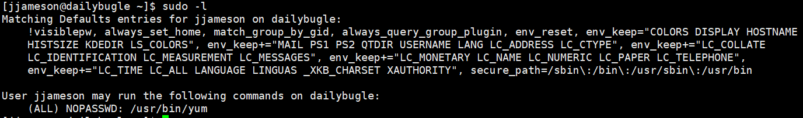 
尝试提权，成功 
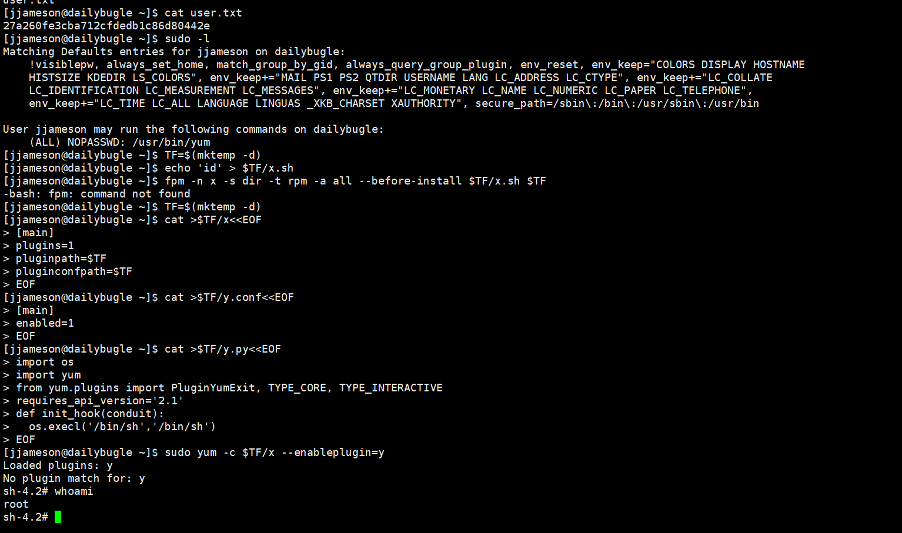