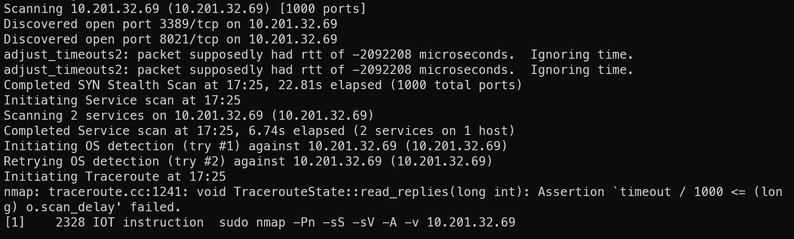

# Flatline

### 信息收集
目标开启了3389端口与8021端口，这能确定目标是windows主机，而8021端口是FreeSWITCH组件服务 

### 利用FreeSWITCH
nc连接目标主机的8021端口，尝试使用FreeSWITCH组件的默认密码，认证成功了 
 
使用FreeSWITCH组件的api system接口，能够成功执行命令 
 
那么接下来准备反弹shell，首先写好powershell反弹shell的命令 
 
由于我想要使用powershell -e执行base64编码的反弹shell，因此首先将反弹命令进行编码 
同时由于-e参数要求Base64编码为UTF-16，因此之间再进行一层转换 
 
运行反弹shell命令 
 
成功获得反弹shell 

### 系统提权
在C盘根目录，我发现了projects这个非常规目录，其下有一个openclinic软件，该软件可造成本地权限提升 
 
首先生成msf木马并开启一个临时http服务 
 
进入openclinic目录，更改原来的mysqld.exe为mysqld.bak 
 
下载msf木马，木马名为mysqld.exe 
 
重启系统，该软件属于system所有并在启动时运行，一旦能够将其中的一个可执行文件替换为我们自己的文件，我们就可以让受害者机器以system身份连接回攻击者机器。 
 
获得system权限 
