# Include

## 信息收集阶段

### nmap
- **发现**：服务器开放多个端口，包括 Web 服务 (4000, 50000) 和 SSH (22)。
- **截图**：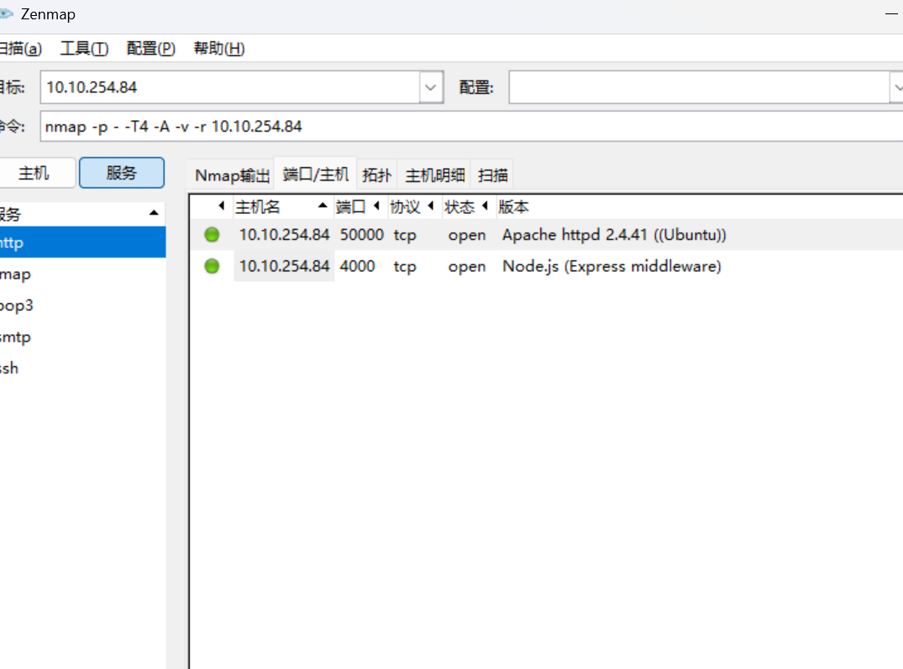

### dirsearch
- **发现**：对端口 4000 和 50000 进行目录扫描，发现 `uploads` 目录。
- **截图**：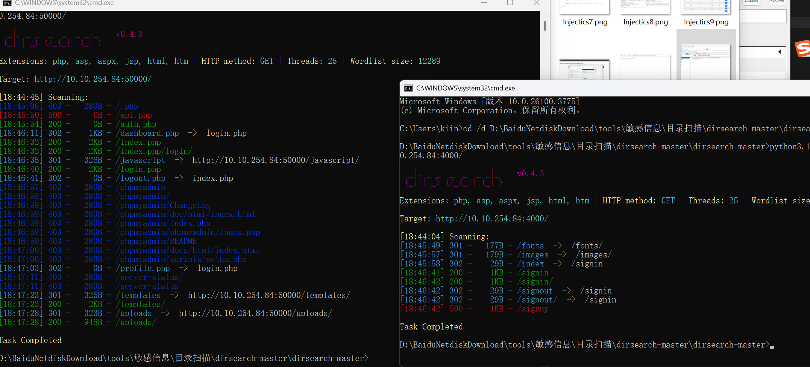

### Web 服务初步探索
- **发现**：
    - 端口 50000：系统监控页面，需要登录。
    - 端口 4000：类似博客的网站，提供游客凭据 `guest:guest`。
    - 访问 `uploads` 目录，发现一张图片。
- **截图**：
    - 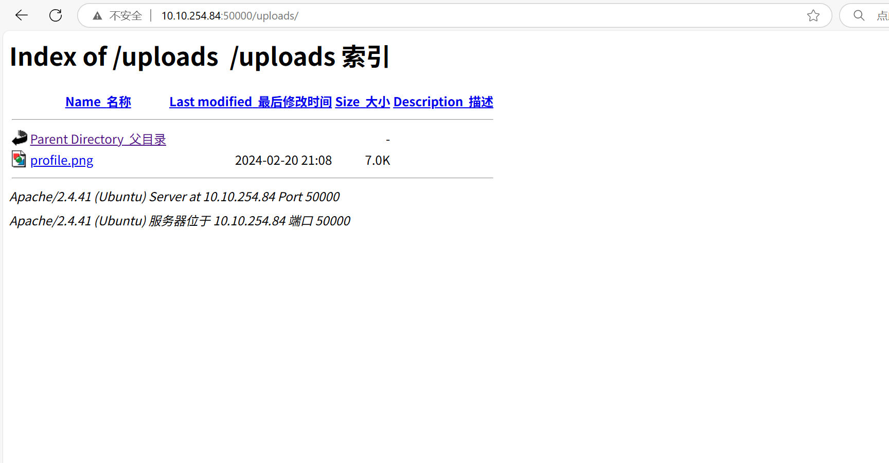 (uploads 内容)
    - 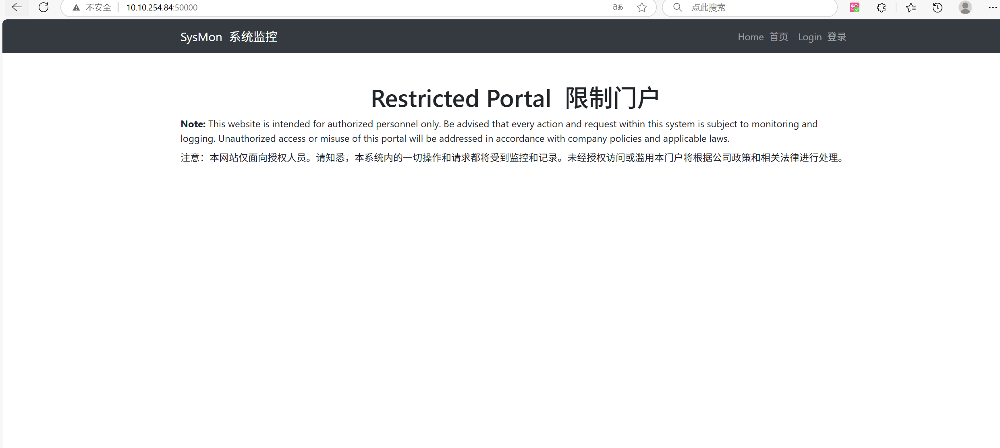 (系统监控登录页)
    - 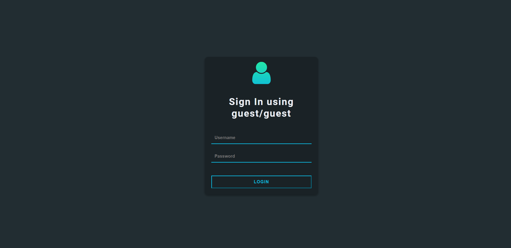 (博客登录页)

### 博客网站信息 (guest 权限)
- **行动**：使用 `guest:guest` 登录博客网站 (端口 4000)。
- **发现**：
    - 可以查看个人资料。
    - 存在好友列表，但好友非管理员。
- **截图**：
    - 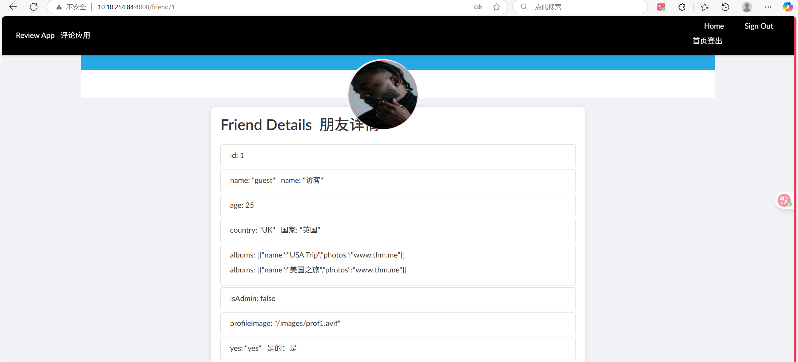 (登录后主页)
    - 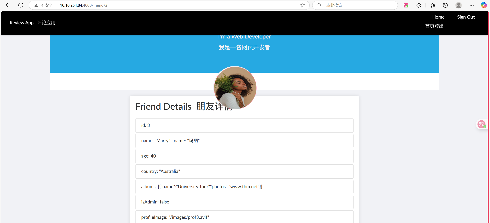 (好友1资料)
    - 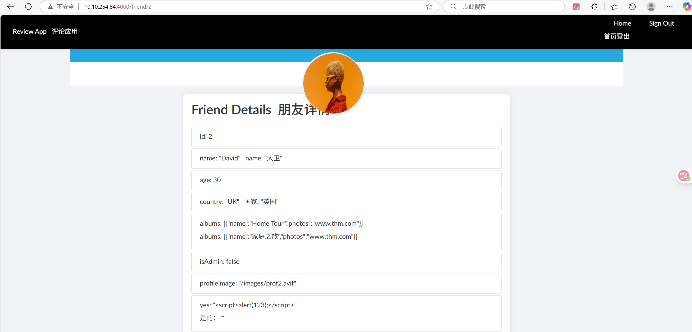 (好友2资料)

---

## 漏洞测试阶段

### 博客网站测试 (权限提升与 SSRF)
- **技术**：利用原型污染，将 `isAdmin` 字段设置为 `true`。
- **发现**：权限提升后，出现新的导航入口 `api` 和 `settings`。
- **截图**：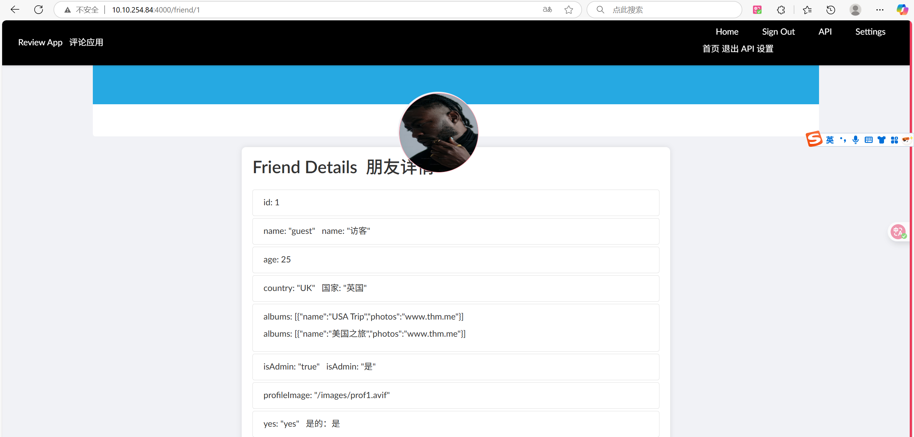
- **发现**：访问 `/api` 页面，提示存在一个内部 API，需要 SSRF 访问。
- **截图**：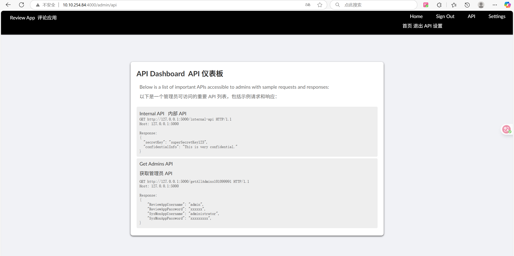
- **发现**：访问 `/settings` 页面，存在明显的 URL 调用功能 (`http://`)，是潜在的 SSRF 点。
- **截图**：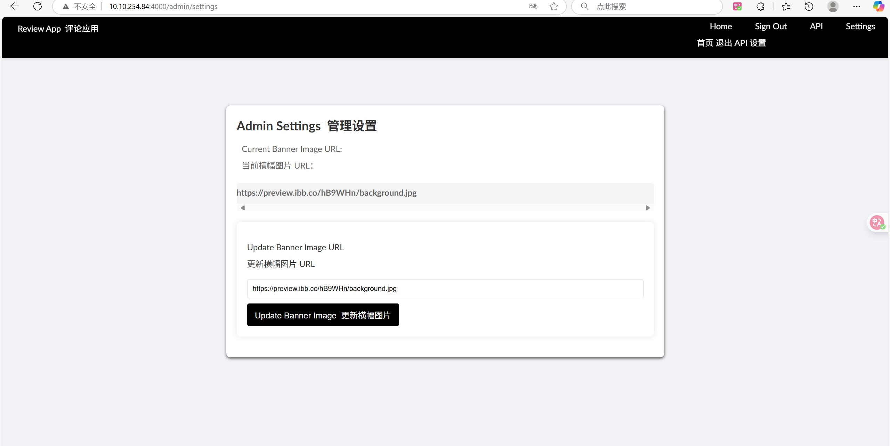
- **技术**：利用 `/settings` 页面的功能进行服务器端请求伪造 (SSRF)。
- **结果**：成功访问内部 API，返回 Base64 编码的数据。解码后获得系统监控页面的凭据。
- **截图**：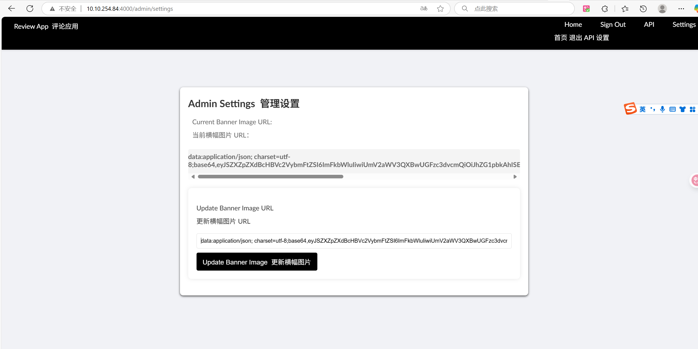 (SSRF 成功返回数据)

### 系统监控页面测试 (凭据利用与 LFI)
- **行动**：使用通过 SSRF 获取的凭据登录系统监控页面 (端口 50000)。
- **结果**：成功登录，获取第一个 flag。
- **截图**：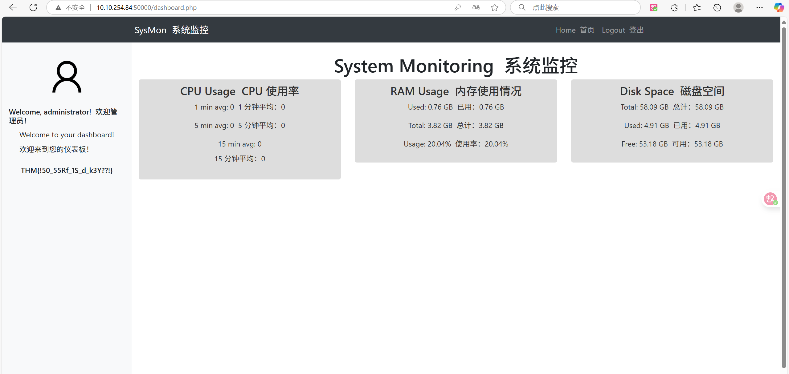
- **发现**：监控页面的管理员头像与 `uploads` 目录中的图片一致，结合页面功能，怀疑存在 LFI 漏洞。
- **截图**：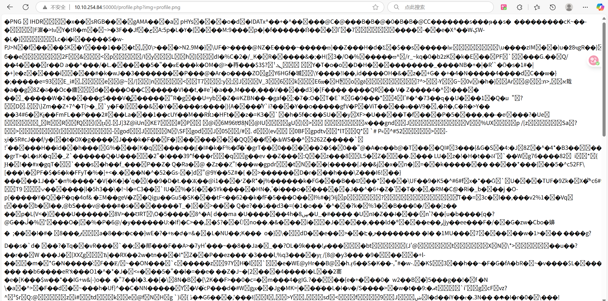 
- **技术**：本地文件包含 (LFI)。
- **结果**：成功读取 `/etc/passwd` 文件，尝试读取 `/etc/shadow` 失败，权限不足。决定尝试 SSH 爆破。
- **截图**：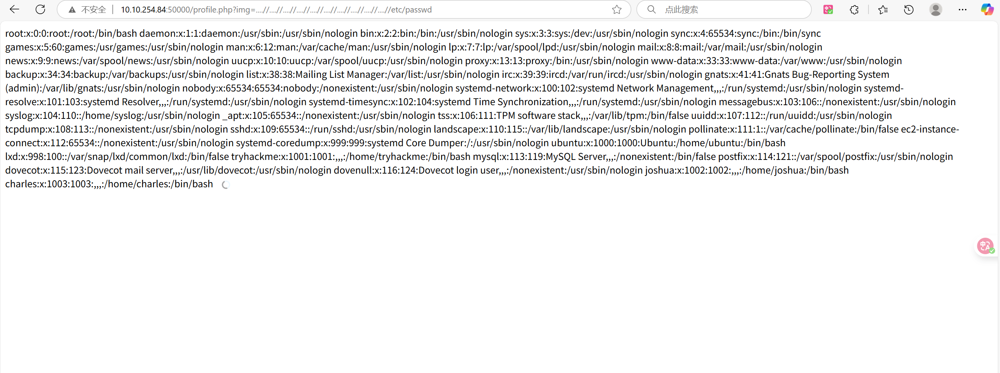 (LFI 成功读取 passwd)

### SSH 爆破
- **工具**：Hydra
- **目标**：爆破 SSH 服务。
- **结果**：成功爆破出密码 `123456`。
- **截图**：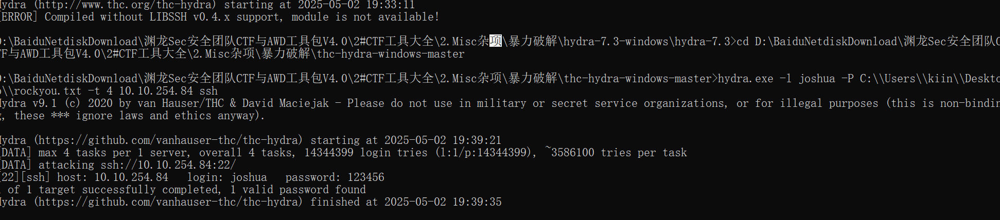

### SSH 登录与最终 Flag 获取
- **行动**：使用凭据 `joshua:123456` 通过 SSH 登录服务器。
- **结果**：成功登录，获取第二个 flag。
- **截图**：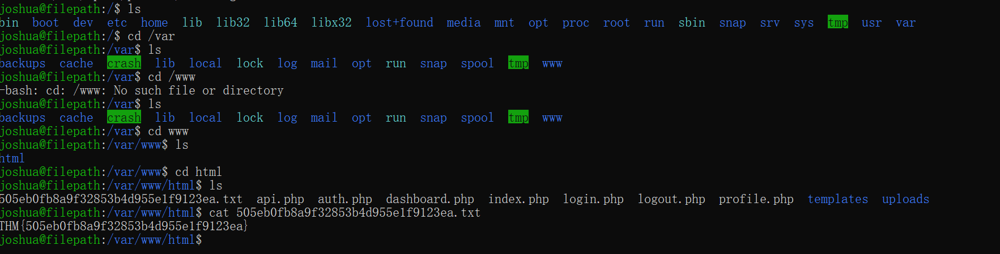