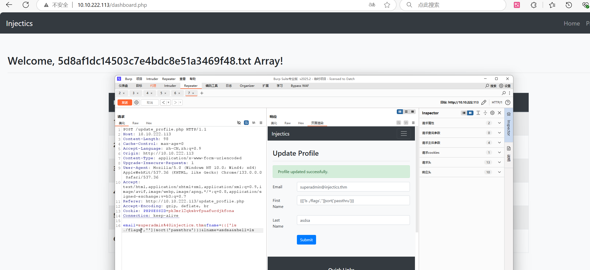

# Injectics

## 信息收集阶段

### nmap
- **发现**：服务器是 Linux 系统，开启了 HTTP 和 SSH 服务。
- **截图**：

### dirsearch
- **发现**：通过 `vendor` 目录可确定使用 Twig 模板引擎，但需进一步调查版本。
- **截图**：

### 信息整理
- **来源**：`composer.json` 文件
- **发现**：服务器使用 Twig 模板 2.14.0 版本，此版本的 `sort` 过滤器允许传递 PHP 函数名作为排序逻辑，Twig 未正确过滤或限制这些函数，导致攻击者可调用危险函数。
- **截图**：

### Injectics 服务
- **来源**：`mail.log` 文件
- **发现**：如果 `users` 表被损坏或删除，开发人员实现的 Injectics 服务会自动插入默认凭据，凭据为文件中提供的数据：
  - `superadmin@injectics.thm:superSecurePasswd101`
  - `dev@injectics.thm:devPasswd123`
- **截图**：

---

## 漏洞测试阶段

### 登录页面测试
- **目标**：登录页面
- **发现**：
  - 查看页面源代码，发现表单通过 AJAX 提交。
  - 客户端 JavaScript（jQuery）对 `mail` 参数进行简单过滤，阻止关键词如 `or`、`union`、`select`、`"`、`'`.
- **截图**：
  - 
  - 

### SQL 注入（绕过登录）
- **技术**：使用 URL 编码的 SQL 注入 payload 绕过客户端过滤。
- **Payload**：
  ```
  Email: test
  Password: %27%20OR%201=1%20--%20
  ```
- **结果**：成功以普通用户身份登录，进入用户主页，发现可能的注入点。
- **截图**：
  - 
  - 

### 删除 users 表
- **技术**：SQL 注入删除 `users` 表，触发 Injectics 服务。
- **Payload**：
  ```
  gold: 22;drop+table+users#
  ```
- **结果**：表删除成功，收到消息提示 Injectics 服务正在恢复数据库（需等待 1-2 分钟）。
- **截图**：

### 管理员登录
- **行动**：等待 1-2 分钟后，使用默认管理员凭据登录：
  ```
  Email: superadmin@injectics.thm
  Password: superSecurePasswd101
  ```
- **结果**：
  - 获取第一个 flag。
  - 发现新页面。
- **截图**：
  - 
  - 

### 新页面测试
- **目标**：新页面（可能是用户资料页面）
- **发现**：页面允许更新个人信息，可能存在模板注入漏洞。
- **截图**：
  - 
  - 

### 确认模板注入
- **测试 Payload**：
  ```
  First Name: {{'Hello'|upple}}
  ```
- **截图**：
  - 
  - 

### 利用 CVE-2022-23614 获取第二个 flag
- **发现**：
  - Twig 2.14.0 的 `sort` 过滤器（CVE-2022-23614）允许传递 PHP 函数名（如 `system`、`shell_exec`）执行命令。
  - 双引号（`"`）被过滤，需使用单引号或无引号。
- **测试 Payload**：
  ```
  First Name: {{!['ls ./flags','']|sort('passthru')}}
  ```
- **结果**：成功获得flag。
- **截图**：
  - 
  - 