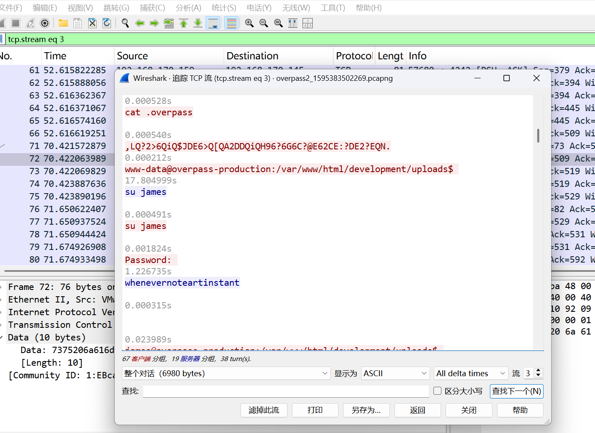

# Overpass 2 - Hacked

### 1.用来上传反向 shell 的页面 URL 是什么？
过滤http协议，发现上传路径 

### 2.攻击者使用了什么有效载荷来获取访问权限？
追踪TCP流，发现payload 

### 3.攻击者使用了什么密码来提升权限？
过滤ip.dst == 192.168.170.145 && tcp.dstport == 4242，追踪TCP流，发现密码 

### 4.攻击者是如何建立持久化的？
查看TCP流，发现攻击者下载了一个ssh后门连接 

### 5.使用 fasttrack 单词列表，系统密码中有多少是可破解的？
有4个 

### 6.后门默认的哈希是什么？
下载后门，默认哈希硬编码在主文件中 

### 7.后门硬编码的盐是什么？
搜索一下salt，发现passwordHandler函数有这个参数，追踪该函数，发现硬编码的盐值 

### 8.攻击者使用了什么哈希？
继续到之前的TCP流中查看 

### 9.使用 rockyou 和你的选择破解工具破解哈希。密码是什么？
先检测一下加密类型，接着使用hashcat工具 
 
 

### 10.使用之前找到的信息，想办法重新入侵.
ssh连接用户尝试失败了，之前破解出的密码都无法使用。接着尝试连接ssh后门的2222端口，强制使用rsa加密连接，输入破解出的后门哈希，成功登陆 
