# Skynet

### 1.信息收集
nmap扫描显示目标主机smb服务有配置错误 
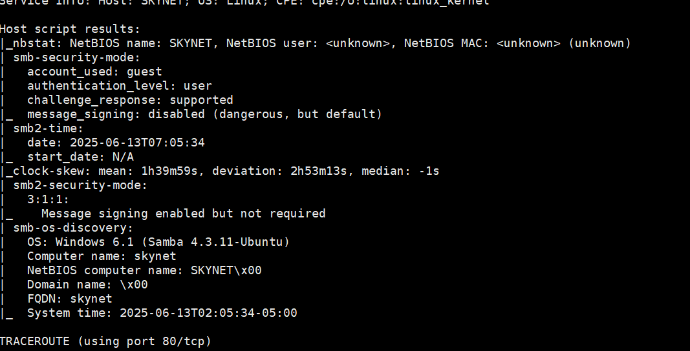 
dirsearch扫描目录发现mail目录 
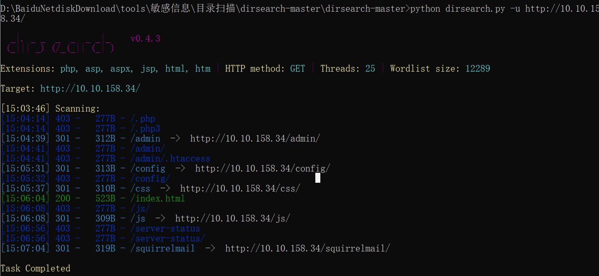

### 2.利用smb服务配置错误
使用smbclient枚举用户 
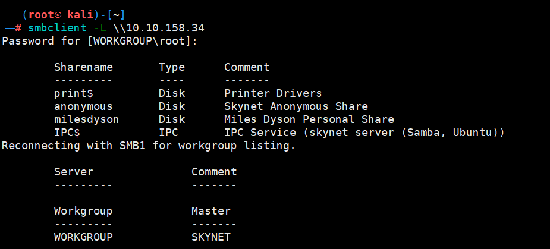 
连接用户，只有anonymous用户可以无密码连接 
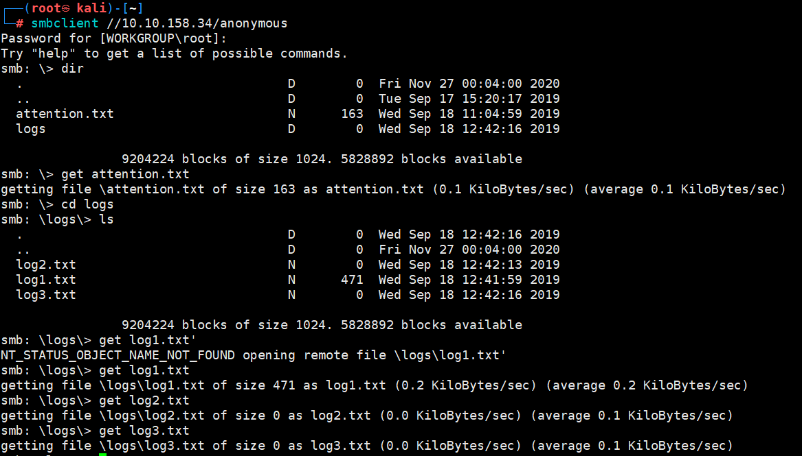 
下载共享目录下的所有敏感文件，查看发现可用的密码字典 
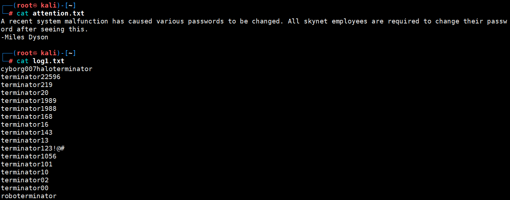 
使用hydra爆破web网站的mail登录页面，得到密码 
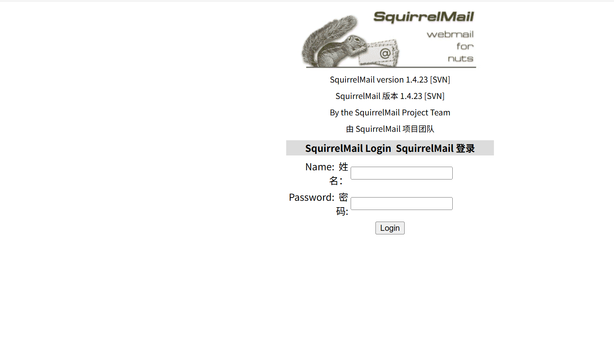 
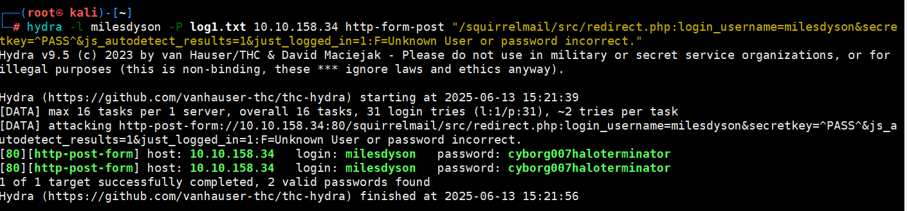 
登陆后看到有一个密码重置邮件，点进去查看，发现了milesdyson的smb密码 
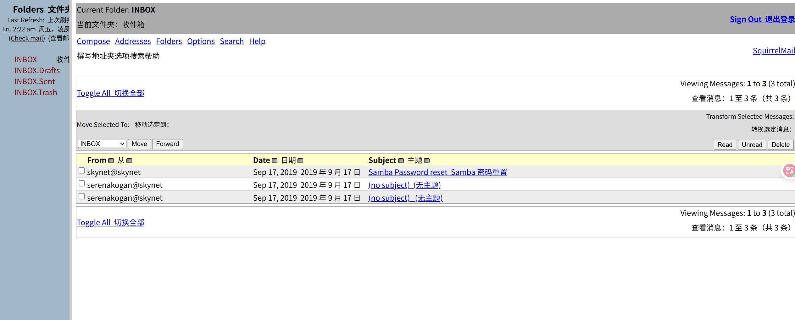 
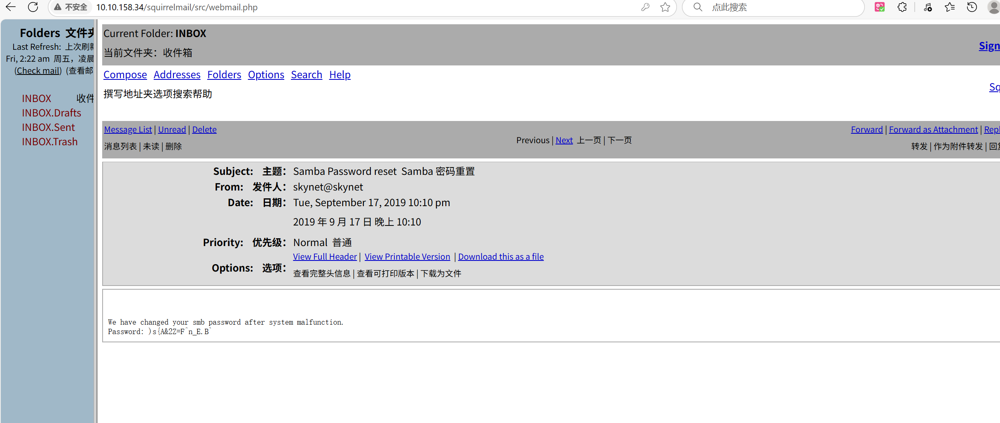 
连上去，查看所有敏感文件，里面提到了一个CMS目录 
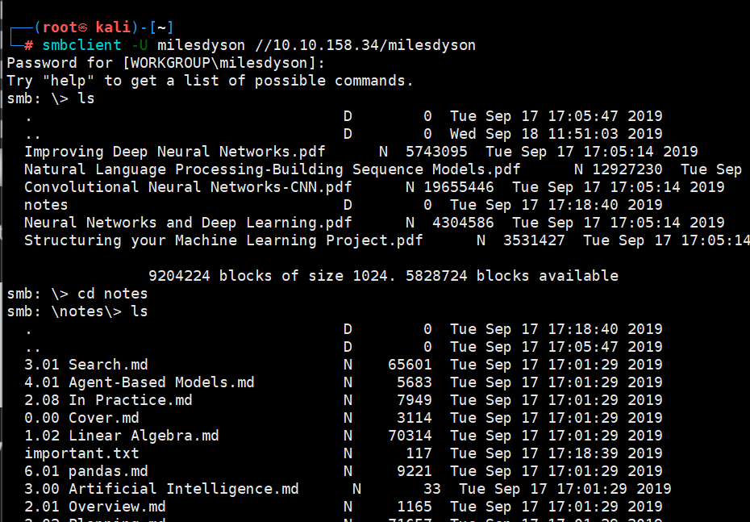 
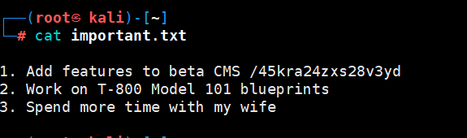

### 3.使用历史漏洞getshell
隐藏目录是一个个人博客CMS，首先目录扫描一下 
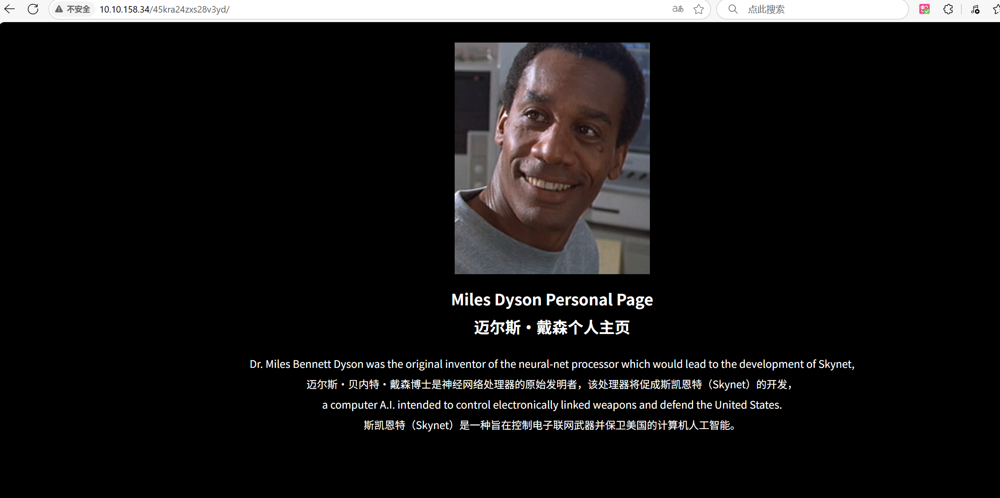 
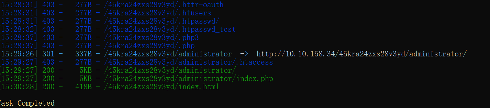 
有个后台登录页面，访问看到cms的名字与版本，去搜索相关exp 
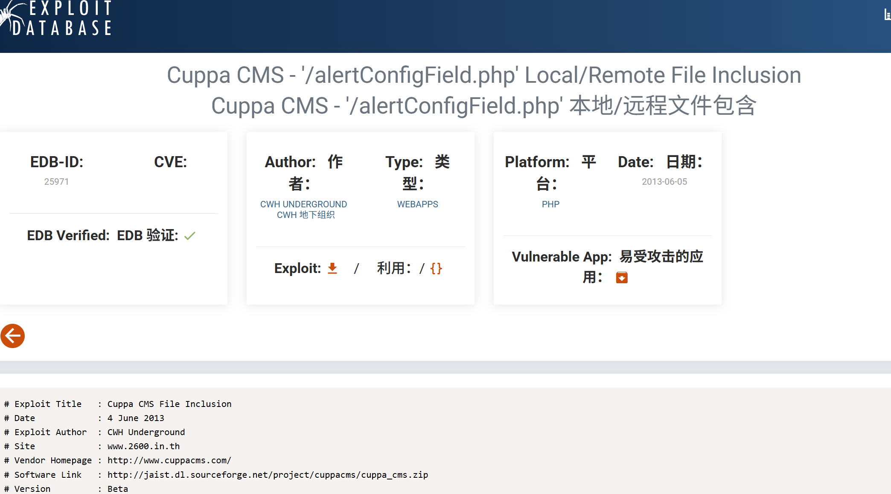 
有远程文件包含的漏洞可利用，因此使用php的反向shell，python创建一个简易的http服务，远程包含getshell 
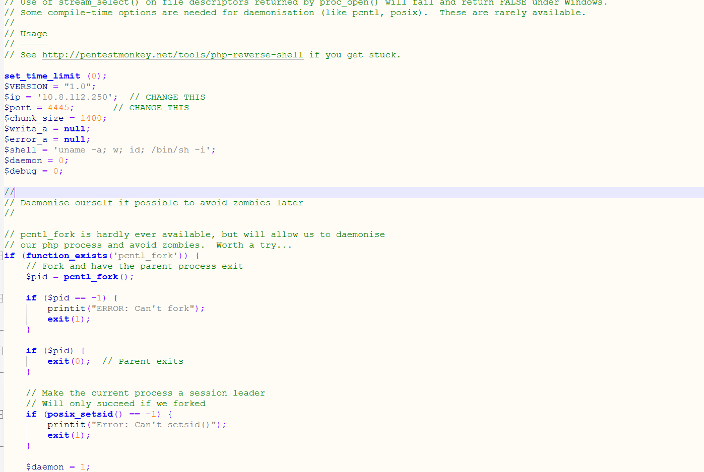 
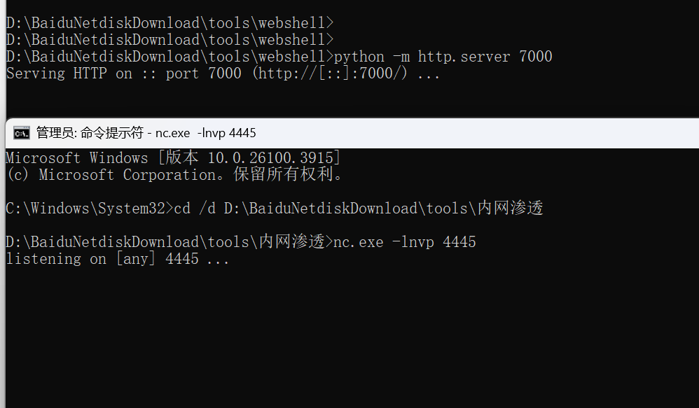 
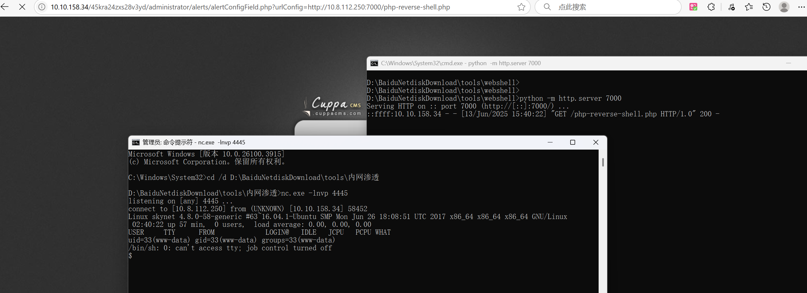 
得到flag 
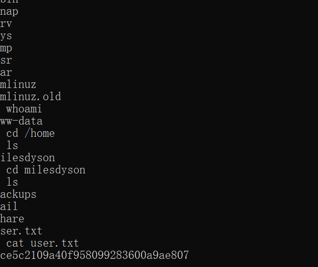

### 4.提升权限
首先检查一下计划任务，看到了backup.sh这个脚本，root启动的 
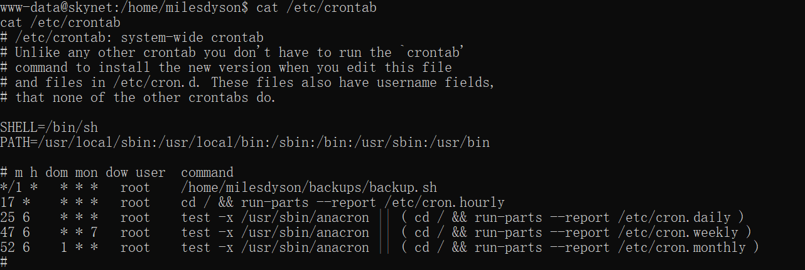 
查看脚本，发现其中是在归档备份html目录下的文件，去查看一下tar有哪些提权姿势 
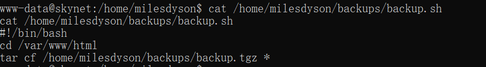 
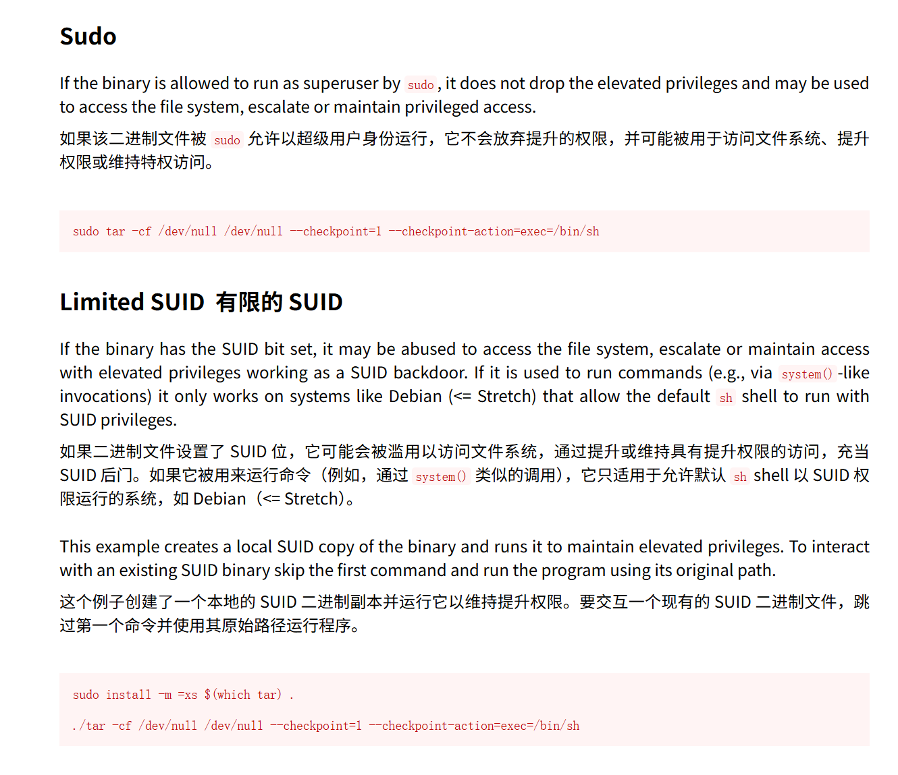 
tar命令有一个–-checkpoint参数，该参数与--checkpoint-action参数一起使用，当检查点被触发时，会执行指定的命令。因此，我们可以使用这个参数来创建SUID文件，执行提权命令。 
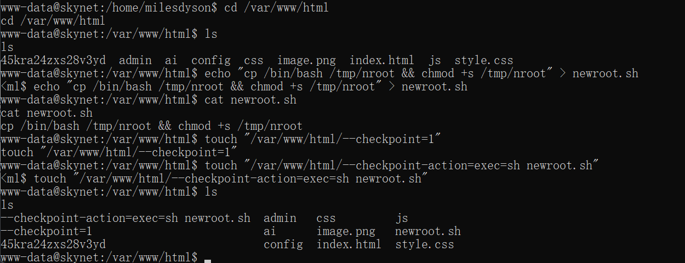 
等待一分钟后，脚本执行完成，/tmp目录下出现bash的副本，并且SUID位被设置，直接-p执行它，提权到root 
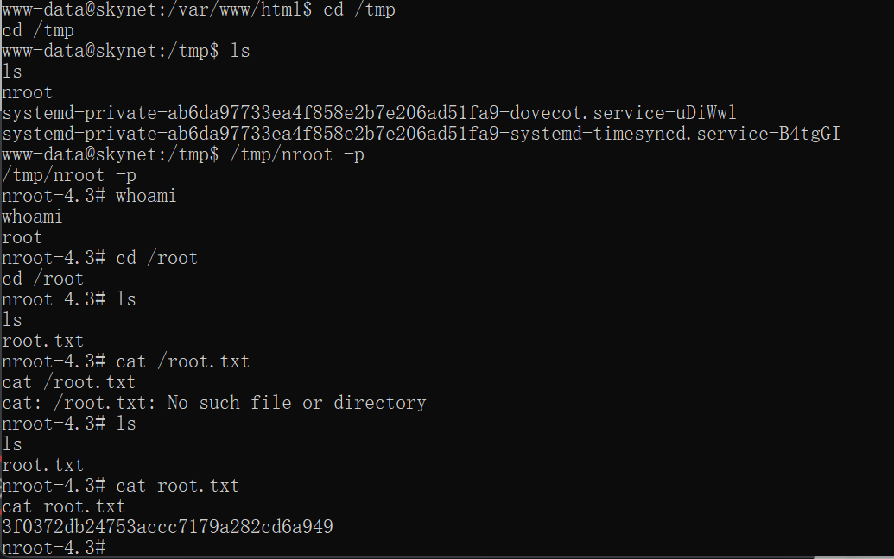