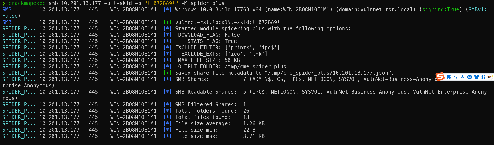
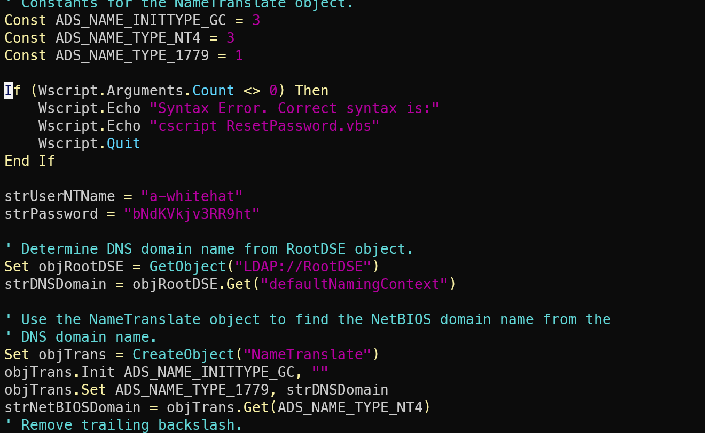

# VulnNet:Roasted

### 信息收集
端口扫描，开了88、135、139、445、389、636、5985等端口，确认为域控服务器，可以打SMB、LDAP、Kerberos等协议，攻击面较多 

### 攻击域控
使用smbmap枚举扫描guest用户，发现存在两个可读文件夹 
 
进入文件夹下载其中所有文件 
 
里面是一些信件消息，其中有一些用户名，猜测是域内用户名，可以通过脚本构造用户名进行枚举，但先看看其他攻击面 
 
使用impacket工具集的lookupsid脚本通过MS-LSAT协议枚举有效的域用户 
 
保存枚举结果，提取用户名 
 
某些用户账户可能被配置为禁用预认证，这样的账户在请求TGT时，KDC会直接返回加密的TGT，而无需用户提供预认证数据，造成AS-REP Roasting攻击。 
使用impacket工具集的GetNPUsers脚本，该脚本通过Kerberos协议连接到域控服务器，提供一个用户列表，通过向KDC发送AS-REQ请求目标用户的TGT 
 
t-skid可以在不需要提供密码的情况下请求票证，使用hashcat爆破密码，得到新的用户凭证 
 
得到了新的用户凭证后，使用crackmapexec继续枚举smb 
 
在结果输出中可以看到该用户的共享文件夹有一个vbs脚本 
 
连接上t-skid的共享目录，下载该vbs脚本 
 
 
脚本中硬编码了一个账号，a-whitehat，正是之前通过MS-LSAT协议枚举出来的其中一个域用户。使用该域用户的凭证连接可以发现该用户是域管理员 
 
使用impacket工具集中的secretsdump脚本通过DrsGetNCChanges从域控制器提取ntds.dit中的用户哈希，获得管理员哈希 
 
利用获取到的用户哈希，通过impacket工具集中的wmiexec脚本执行Pass-the-Hash攻击建立WMI会话，成功获得管理员权限 
