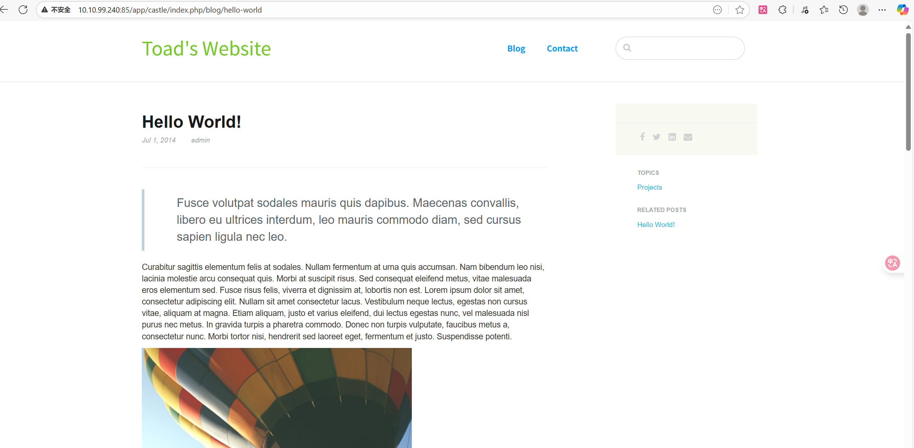
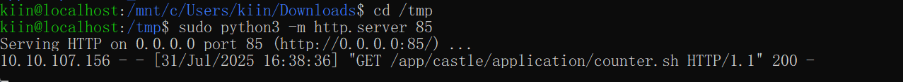

# mKingdom

### 信息收集
端口扫描，http服务开在85端口上 
 
dirsearch扫目录，发现web应用程序 
 
该web应用程序是一个叫做concrete5的CMS，版本是8.5.2，随意点击看到存在一个admin用户 

### 弱口令
利用找到的admin用户尝试弱口令，密码为password 

### 反弹shell
在CMS后台有上传文件的功能，尝试上传反弹shell，但显示扩展名无效，检查一下设置 
 
修改设置添加允许php扩展名，上传反弹shell成果 
 
成功getshell 

### 横向提权
当前用户是www-data，尝试本地枚举操作系统与内核、本地用户与本地组，可以发现存在mario和toad两个用户，并且www-data无法访问这两个用户的家目录 
但尝试检查web应用程序的配置文件，发现database.php文件中存在数据库的连接信息，用户名是toad，猜测连接密码也是toad的shell密码 
 
成功登陆上了toad，并且在搜索SUID程序时发现cat命令存在SUID权限，但该应用程序的所属用户是toad，无法用来提权为root 
 
继续枚举检查了toad用户的crontab、sudo、可写可读文件，在检查PATH变量时发现env里有一个PWD_token，base64解码后是一串字符，可能是其他用户的密码 
 
确认为mario的密码，并且读取flag 

### 纵向提权
登陆到mario用户后，继续进行提权要素枚举，搜索该用户的可写可读文件、crontab、配置文件、日志文件等，发现/var/log/up.log日志文件似乎每分钟会添加一条记录 
递归搜索存在TheCastleApp字符的文件，可以发现counter.sh脚本每隔一分钟运行一次，可能是另一个用户下的crontab的cron任务执行的。 
 
由于不知晓具体的计划任务命令，因此可以下载pspy工具来监控进程，在文件被创建、修改、删除、访问等操作时获得通知。该应用程序不需要特权用户来使用这个API 
下载后本地用python开启一个http服务 
 
下载到靶机上，设置好执行权限，开始监控，注意挂入后台 
 
发现了计划任务命令，该命令运行curl mkingdom.thm:85/app/castle/application/counter.sh 
运行/bin/sh -c curl mkingdom.thm:85/app/castle/application/counter.sh | bash >> /var/log/up.log将counter.sh的输出通过管道输入到bash中 
这会导致counter.sh的代码被执行 
 
任务正在root crontab中运行，操控了该计划任务即可成功提权为root。但tcp/85端口是特权端口，无法使用端口转发。counter.sh无法被当前用户写入。 
计划任务使用绝对路径，无法利用PATH注入。脚本本身的内容只运行ls -laR | wc。无法替换sh、curl、bash、ls或wc，它们不可写。 
但最终发现可以操控/etc/hosts文件 
 
本地模拟假冒脚本 
 
由于权限原因，使用sed修改hosts，将mkingdom.thm指向本地地址 
 
等待一会，靶机成功访问http服务，root的计划任务执行我所构造的chmod 4755 bash，将bash设为SUID程序 
 
成功提权为root 
